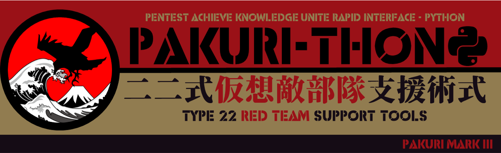

# PAKURI-THON

Pentest Achieve Knowledge Unite Rapid Interface - Python  
PAKURI-THON is a tool that supports pentesters with various pentesting tools and C4 server (command & control and chat & communication server). PAKURI-THON can perform most of the operations with intuitive web operations and commands to chatbots.

## What is PAKURI

I've consulted many pentesting tools. I then took the good points of those tools and incorporated them into my own tools. In Japanese slang, imitation is also called "paku-ru".
> ぱくる (godan conjugation, hiragana and katakana パクる, rōmaji pakuru)
>
> 1. eat with a wide open mouth
> 2. steal when one isn't looking, snatch, swipe  
> 3. copy someone's idea or design  
> 4. nab, be caught by the police  
>
> [Wiktionary:ぱくる](https://en.wiktionary.org/wiki/%E3%81%B1%E3%81%8F%E3%82%8B "ぱくる")

## Why Develop this Tool?

PAKURI-THON is an upgraded version of PAKURI that was presented at the 2020 Blackhat Asia Arsenal.
After the COVID-19 pandemic, the way we work has changed drastically and working remotely from home instead of going to the office has become the norm. This change in the way we work has increased security risks, raised awareness of security and increased the demand for pen testing.  
However, there is still a shortage of security personnel in Japan. As the workload increases while the manpower does not, pen-testing becomes a monotonous and boring job, lowering the quality.  
So, if we automate the boring and simple work, the machine will do the same work over and over again with accuracy, but is that really enough? Pen testing tools are also becoming more and more automated, but is that really enough?  
I don't think so. I don't want to let machines take all the fun out of my life. But I don't like boring work. So I decided to enjoy boring work together with machines. The answer is PAKURI-THON.  
PAKURI-THON was rebuilt in Python to improve the usability of PAKURI. As a result, it implements a web interface, making it much more intuitive and stylish than before.
Specifically, once PAKURI-THON is connected to the target network, it can be operated from a smartphone or tablet.  
You can also use chat to share information with your team. Also, most operations can be solved by giving instructions to the bot. Therefore, there is no need to switch the method of information sharing when working with a team.
Best of all, wouldn't it be cool to be able to do a pen test just by talking to the machine using your smartphone, just like the hacker in the movie?

---

## Features

- The web interface is implemented so that it can be operated intuitively on smartphones and tablets. We were able to fit all of the pentests into the palm of our hand.
- Since we have a terminal in the web interface, you can operate the Kali Linux terminal directly from your smartphone or tablet. If you are using a tablet, you can hold it horizontally to enable some keyboard operations.
- The use of chatbots. Just talk to the chatbot (give instructions) and it will execute the command, which increases convenience as there is no need to switch the means of information sharing within the team.
- PowerShell Empire, which is used in actual cyber attacks, can be controlled through a web interface and can easily be used for red team training.

## Tool used

### Installed on kali linux

- [Nmap](https://www.kali.org/tools/nmap/)
- [Nikto](https://www.kali.org/tools/nikto/)
- [PowerShell Empire](https://www.kali.org/tools/powershell-empire/)

### Added tools

- [AutoRecon](https://github.com/Tib3rius/AutoRecon) 
- [WebSSH](https://github.com/huashengdun/webssh) 
- [Nextcloud](https://github.com/nextcloud) 

|**CAUTION**  |
|:----------------|
|If you are interested, please use them in an environment **under your control and at your own risk**. And, if you execute the PAKURI-THON on systems that are not under your control, it may be considered an attack and you may have legally liabillity for your action.|

## Install & Usage

There are several means of installation. For manual installation, please refer to the [PAKURI-THON wiki](https://github.com/01rabbit/PAKURI-THON/wiki).  
If you want to use the installer, please run the following command. **You'll need root privileges to run it!**

``` shell
sudo ./install.sh
```

After the installation is complete, run the following command. **You'll need root privileges to run it!**

``` shell
sudo ./pkr3.sh
```

``` text
   ___  ___   __ ____  _____  ____   ________ ______  _  __
  / _ \/ _ | / //_/ / / / _ \/  _/__/_  __/ // / __ \/ |/ /
 / ___/ __ |/ ,< / /_/ / , _// //___// / / _  / /_/ /    / 
/_/  /_/ |_/_/|_|\____/_/|_/___/    /_/ /_//_/\____/_/|_/  
                                                           
Tue Jan 25 08:24:53 AM EST 2022
Running system check...
Checking for root access... OK
Checking docker startup... OK
Checking for postgres...OK
Checking for SSH Service...OK
Checking for WebSSH...OK
Checking for NextCloud...OK
Booting up PAKURI-THON...  >>>>>>>>>>>>>>>>> done!
```

By default, PAKURI-THON is wating for you on port 5555, so please access it with a web browser.  
The following ports are used by PAKURI-THON.
| Application | Port |
| ---- | ---- |
| PAKURI-THON | 5555 |
| PostgreSQL | 15432 |
| Nextcloud | 8080 |
| WebSSH | 8888 |
| PowerShell Empire | 1337, 8088 |

## Demo

[](https://www.youtube.com/watch?v=14Mz13PY5-I)

## Screenshot

### Main menu

It is designed to be operable on smart phone and tablets. The honeycomb struture menu at the bottom right is a shortcut menu for one-handed operation. (Press the bottom right button to expand the menu as shown in the image. Normally, it is hidden.)  


### Target

When a scan is performed and a host is found, an icon will be displayed. Click on the icon to display detailed information about the host.  


### Recon

You can use Nmap and Nikto for reconnaissance activities. You can also use the terminal if you want to command other Kali tools.  


### Post-Exsploit

You can operate PowerShell Empire, create Stagers, and manage Agents.  


### Terminal

By using WebSSH, you can operate the terminal console of PAKURI-THON directly on your web browser.  


### Chat : Nextcloud

You can use Nextcloud chat to facilitate communication within your team. You can execute various commands by simply commanding the bot in the chat.  


### Docker

Start and stop Docker.  


### Smartphone

If you use a smart phone, you can use the Nextcloud application.  


---

## Operation check environment

- OS: KAli Linux 2021.4a
- Memory: 8.0GB
- Browser:
  - Firefox: 96.0
  - Google Chrome: 97.0
  - Chromium: 97.0
  - Brave: 1.34.81

## Known Issues

- This is intended for use Kali Linux. Operation on other OS is not guaranteed.

---

## Contributors

If you have some new idea about this project, issue, feedback or found some valuable tool feel free to open an issue for just DM me via [@Mr.Rabbit](https://twitter.com/01ra66it) or [@PAKURI](https://twitter.com/PAKURI9).
